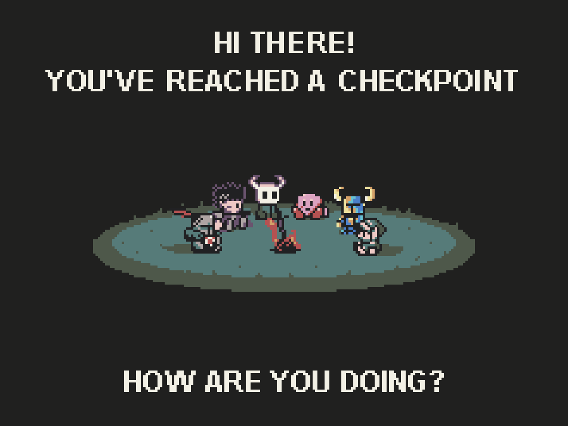

  
  <h1>
  Hello there!
    
    
  I'm Pedro Henrique
</h1>

  
###  About Me:  
  I’m a programming enthusiast whose love for games led me to study computing, where I quickly developed a passion for the field. My desire to learn began in university, where solving problems and continuous learning were my greatest joys.

### Language and Tools:

    
    
    
    
    
    
    
    
    
    
    

---

   

     
    
  
 

---
